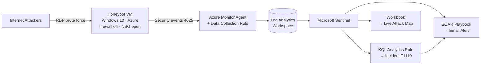
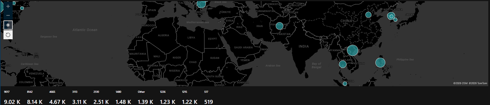
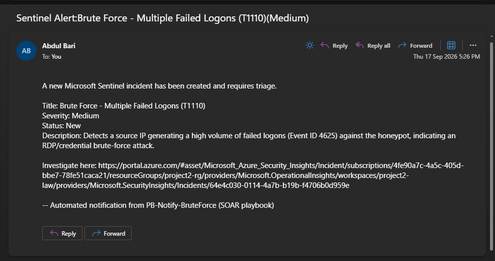
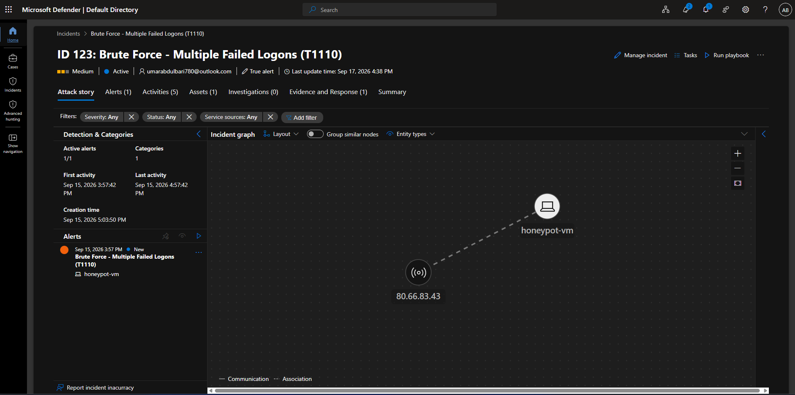
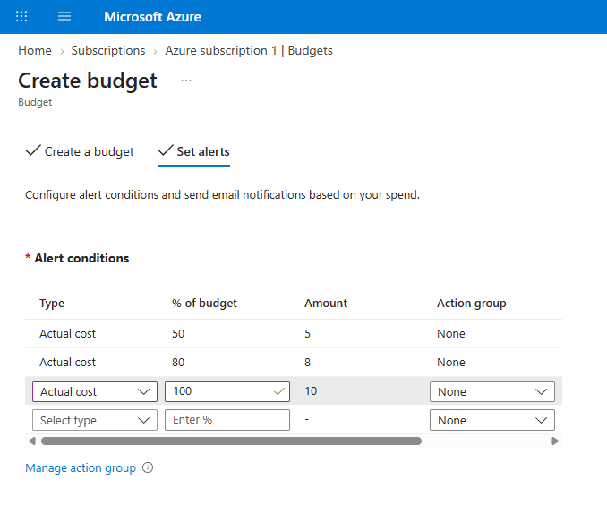

# Cloud SIEM & SOAR - Microsoft Sentinel + Defender XDR with a Live Attack Map

> A cloud-native SOC lab: an internet-exposed Windows honeypot draws real-world attackers, their brute-force activity is detected in **Microsoft Sentinel** with **KQL**, plotted on a **live geo-IP attack map**, and auto-responded to with a **SOAR playbook** — all built inside the Azure free tier for **$6.34** total.


---

## Overview

This project builds a **cloud detection-and-response lab** centered on a deliberately exposed Windows honeypot. Within minutes of going live, automated attackers from around the world began brute-forcing it over RDP. Those attacks were ingested into a cloud SIEM, turned into triaged incidents by custom detection rules, visualised on a world map by attacker origin, and answered by an automated response playbook.

It is **Project 2** in a cybersecurity portfolio and the cloud counterpart to Project 1, [SOC Home Lab — Detection Engineering & Threat Hunting with Splunk](https://github.com/abdul48bari/splunk-soc-detection-lab). Where Project 1 was an on-premises Splunk lab with simulated attacks, this project moves the same detection-engineering discipline into the cloud (Splunk → Sentinel, SPL → KQL, local VMs → Azure) and detects **genuine internet attacks** rather than simulated ones.

## Objectives

- Stand up **Microsoft Sentinel** on a Log Analytics workspace as a cloud SIEM.
- Deploy a **cloud honeypot** and expose it to the public internet to attract real attackers.
- Ingest Windows security telemetry using the **Azure Monitor Agent** and a **Data Collection Rule**.
- Write **KQL analytics rules** that automatically generate and enrich incidents.
- Visualise attacker origins on a **live geo-IP attack map**.
- Automate incident response with a **SOAR playbook** (Azure Logic App).
- Investigate and triage a real incident, mapped to **MITRE ATT&CK**.
- Do all of the above **within the Azure free tier**, with cost controls set up first.

## Architecture



**Flow:** attacker → exposed honeypot → agent ships logs → Log Analytics → Sentinel → (detection → incident), (geo-enrichment → map), (automation → response).

## Build Summary

| Layer | Component | Notes |
|---|---|---|
| Cost control | Budget + cost alerts | Configured **before** any resource was deployed |
| Platform | Resource Group, Log Analytics Workspace, Microsoft Sentinel | Single region, single container for clean teardown |
| Target | Windows 10 honeypot VM | Public IP, RDP exposed, host firewall disabled, NSG opened wide |
| Ingestion | Windows Security Events via AMA + Data Collection Rule | Writes to the `SecurityEvent` table |
| Detection | Scheduled KQL analytics rule | Auto-creates incidents, entity-mapped, MITRE-tagged |
| Visualisation | Sentinel Workbook + native KQL geo-enrichment | Live world map of attacker origins |
| Automation | Azure Logic App (Consumption) | Incident-triggered email alert |

## Detection Engineering (KQL)

The core detection is a scheduled analytics rule that fires when any single source IP produces a high volume of failed logons (Windows Event ID **4625**) against the honeypot.

```kql
SecurityEvent
| where EventID == 4625
| where isnotempty(IpAddress) and IpAddress != "-"
| summarize FailedAttempts = count(), TargetedAccounts = make_set(Account, 10)
    by IpAddress, Computer
| where FailedAttempts >= 10
```

- **Entities mapped:** source IP (`Address`) and host (`HostName`) — making each incident investigable.
- **Schedule:** runs every 5 minutes over a 1-hour lookback.
- **MITRE ATT&CK:** **T1110 — Brute Force** (Credential Access).
- **Output:** a Medium-severity **incident** created automatically for triage.

## Live Attack Map

Instead of a static GeoIP lookup file, attacker IPs are enriched **natively in KQL** using `geo_info_from_ip_address()`, then plotted on a Sentinel Workbook map — bubbles sized by attack volume.

```kql
SecurityEvent
| where EventID == 4625
| where isnotempty(IpAddress) and IpAddress != "-"
| summarize FailedAttempts = count() by IpAddress
| extend GeoInfo = geo_info_from_ip_address(IpAddress)
| extend Country   = tostring(GeoInfo.country),
         City      = tostring(GeoInfo.city),
         Latitude  = todouble(GeoInfo.latitude),
         Longitude = todouble(GeoInfo.longitude)
| where isnotempty(Country)
| project IpAddress, Country, City, Latitude, Longitude, FailedAttempts
```



### Observed attackers (sample)

| Source IP | Country | City | Failed Attempts | Targeted Account |
|---|---|---|---:|---|
| 119.92.10.157 | Philippines | Manila | 3,113 | `administrator` |
| 45.40.82.16 | United States | Manhattan | 523 | username spray |
| 59.15.116.99 | South Korea | Yangcheon-gu | 459 | `ADMINISTRATOR` |
| 91.99.132.116 | Germany | Nuremberg | 4 | `administrator` |

## SOAR Automation

An Azure Logic App playbook (`PB-Notify-BruteForce`) is triggered by the Sentinel incident and automatically emails the analyst the incident title, severity, status, and investigation link — the classic SOAR notification/enrichment response.

- **Trigger:** Microsoft Sentinel incident
- **Action:** Send email (Outlook.com connector) with dynamic incident details
- **Permissions:** Sentinel granted the *Microsoft Sentinel Automation Contributor* role on the resource group
- **Cost:** within the Logic Apps free grant (4,000 actions/month) — **$0**



## Incident Investigation

Each detection produces a full incident with an attack-story graph linking the attacker IP to the honeypot host. Triage steps performed: assigned ownership, set status to Active, classified as a true positive, documented findings, and confirmed the MITRE technique.



**Triage summary:** a single source IP generated thousands of failed RDP logons against `honeypot-vm`, targeting `administrator` and common accounts — an automated brute-force (**T1110**). No successful logon (Event ID 4624) was observed from the attacker; recommended response is to block the IP at the NSG.

## Cost Discipline

Cost controls were the **first** thing configured, before any billable resource existed.



| Item | Cost |
|---|---:|
| Honeypot VM (compute) | $5.44 |
| Standard HDD disk | $0.55 |
| Public IP | $0.34 |
| Sentinel ingestion (10 GB/day free trial) | $0.00 |
| Logic App playbook (free grant) | $0.00 |
| **Total** | **$6.34** |

**$0.00 charged** — the entire lab ran on Azure free-tier credit, with budget alerts armed and the VM deallocated once data collection was complete.

## Skills Demonstrated

`Microsoft Sentinel` · `KQL` · `Microsoft Azure` · `Microsoft Defender XDR portal` · `Azure Logic Apps (SOAR)` · `Log Analytics` · `Azure Monitor Agent & Data Collection Rules` · `Cloud SIEM` · `Detection Engineering` · `Incident Triage & Investigation` · `Threat Visualisation` · `MITRE ATT&CK` · `Cloud Cost Management`

## Repository Structure

```
.
├── README.md
├── screenshots/
│   ├── 01-cost-budget-alert.png
│   ├── 02-incident-triage.png
│   ├── 03-attack-map.png
│   └── 04-soar-playbook.png
├── kql-queries/
│   ├── 01-failed-logons-by-ip.kql
│   ├── 02-geo-enriched-attacks.kql
│   └── 03-bruteforce-analytics-rule.kql
├── playbooks/
│   └── PB-Notify-BruteForce.json
└── docs/
    └── incident-investigation.md
```

## Teardown

To avoid any ongoing charges, the entire lab is removed by deleting a single resource group:

```
Azure Portal → Resource groups → Project2-RG → Delete resource group
```

Because every resource was deployed into one resource group, a single delete returns spend to zero.

---

*Project 2 of a hands-on cybersecurity portfolio. See also [Project 1 — SOC Home Lab with Splunk](https://github.com/abdul48bari/splunk-soc-detection-lab).*
